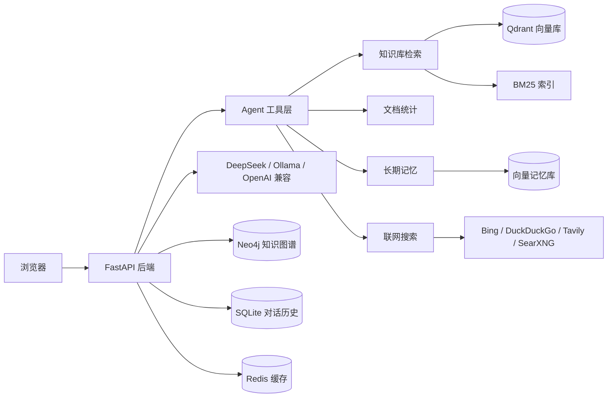

# PDH-PKG

PDH-PKG 是一个面向个人电脑的本地知识库系统。上传 PDF、Word、Markdown、TXT 文档后，系统会自动完成解析、分块、向量化和入库；之后你可以通过对话方式提问，回答基于你自己的文档，并支持联网搜索、长期记忆和可选的知识图谱增强。

> 项目定位为个人单机使用，不包含多租户、RBAC、SSO 等企业级功能。

## 核心特性

- 文档解析：PDF（含图片型 PDF OCR，安装包内置 Tesseract）、DOCX、MD、TXT
- 分块入库：自动分块、向量化、写入 Qdrant
- 混合检索：向量语义检索 + BM25 关键词检索 + RRF 融合
- Agent 工具调用：知识库检索、文档统计、长期记忆、联网搜索
- 对话模型：DeepSeek / Ollama / LM Studio / 任意 OpenAI 兼容接口
- 向量模型：Ollama 或本地 ONNX，可在设置页切换
- 长期记忆：自动总结重要对话事实并跨会话召回
- 知识图谱（可选）：Neo4j 实体关系抽取与图谱增强检索
- 免登录优先：本地自动获取令牌，可开启访问密码

## 系统架构



## 技术栈

| 模块 | 技术 |
|---|---|
| 后端 | Python 3.10+、FastAPI、Uvicorn |
| 向量库 | Qdrant |
| 检索 | LangChain、rank-bm25、MMR/RRF |
| 图谱 | Neo4j |
| 缓存/任务状态 | Redis（可选，未启动时内存回退） |
| 模型 | DeepSeek / OpenAI 兼容 SDK、LangChain Ollama、FastEmbed ONNX |
| 前端 | HTML、CSS、原生 JavaScript |

## 环境要求

- Windows 10/11 x64
- Python 3.10+（推荐 3.12）
- 可选服务：
  - Redis：缓存加速；不启动时自动回退
  - Ollama：本地对话 / Ollama 向量模型
  - Neo4j：知识图谱；不启动时不影响普通对话与检索

## 快速开始

```powershell
git clone <仓库地址>
cd <项目目录>

# 安装依赖
python -m pip install -r requirements.txt

# 复制配置模板并填写 API Key
Copy-Item .env.example .env
notepad .env

# 启动后端
python -m uvicorn app.main:app --host 127.0.0.1 --port 8001
```

浏览器打开 `http://127.0.0.1:8001`。首次访问会自动获取本地令牌，并弹出首次启动引导，选择对话与向量模型；之后随时可在“设置”页修改、测试连接，上传文档后即可提问。

> 正式安装包已内置 Tesseract OCR 与 Qdrant。源码方式启动时，若需要识别扫描版 PDF，请自行安装 Tesseract 并确保 `tesseract` 在系统 PATH 中。

Qdrant：从 Qdrant Release 下载 `qdrant-x86_64-pc-windows-msvc.zip`，解压后将 `qdrant.exe` 放到项目根目录的 `qdrant/` 文件夹，后端启动时会自动拉起。

## 服务说明

| 服务 | 端口 | 是否必需 | 说明 |
|---|---|---|---|
| PDH-PKG 后端 | 8001 | 必需 | 主访问入口 |
| Qdrant | 6333 | 必需 | 手动安装，后端可自动拉起 |
| Redis | 6379 | 可选 | 未启动时使用内存回退 |
| Ollama | 11434 | 可选 | 本地模型与默认向量模型 |
| Neo4j | 7687 / 7474 | 可选 | 仅知识图谱功能需要 |

## 配置

复制 `.env.example` 为 `.env` 后填写实际值。`.env` 已被 `.gitignore` 忽略，不会提交到仓库。

| 配置 | 说明 |
|---|---|
| `DEEPSEEK_API_KEY` | DeepSeek API Key，云端对话必填 |
| `DEEPSEEK_BASE_URL` | DeepSeek / OpenAI 兼容地址 |
| `DEEPSEEK_MODEL` | 对话模型名 |
| `EMBEDDING_MODEL` | 默认 Ollama 向量模型名 |
| `EMBEDDING_BASE_URL` | Ollama / OpenAI 兼容向量服务地址 |
| `QDRANT_HOST` / `QDRANT_PORT` | Qdrant 地址 |
| `REDIS_URL` | Redis 地址 |
| `NEO4J_PASSWORD` | Neo4j 密码 |
| `PRESET_USERS` | 账号密码列表，对外开放前必须修改 |
| `JWT_SECRET_KEY` | JWT 密钥，对外开放前必须修改 |
| `DATA_DIR` | 数据目录，默认 `./data` |
| `TESSERACT_CMD` | OCR 可执行文件；打包版自动使用内置目录，源码调试默认 `tesseract` |
| `OCR_LANG` | OCR 语言，默认 `chi_sim+eng` |

### 向量化模型

正式版首次启动默认使用内置本地 ONNX 模型 `BAAI/bge-small-zh-v1.5`（512 维），完整安装开箱即用，无需联网。也可以在设置页切换为 Ollama `qwen3-embedding:4b`（2560 维）或任意 OpenAI 兼容向量接口，设置页的“测试连接”会显示当前模型的实际维度。

切换向量模型后，已有索引的维度可能不匹配，需要在“文档管理”页点击“重建索引”，或删除文档后重新上传。

### 聊天模型

- DeepSeek：在 `.env` 配置 API Key，或在设置页填写
- Ollama / LM Studio：在设置页切换本地服务并填模型名
- 任意 OpenAI 兼容服务：在设置页填写 Base URL、API Key、模型名

### 联网搜索

默认 `auto` 模式不需要 API Key：优先使用 Bing，失败后自动切换 DuckDuckGo。可选 Tavily 或 SearXNG。

## 日常使用

1. 首次启动按引导选择对话模型与向量模型；设置页可测试连接
2. 在知识库页上传文档，等待分块、向量化、图谱抽取完成；切换向量模型后可在该页点击“重建索引”
3. 在设置页“应用设置”中可修改服务端口、开启关闭窗口最小化到托盘，并提供 Ollama / LM Studio / Neo4j 下载引导
3. 新建对话并提问，回答过程中可查看检索来源、工具调用与图谱证据
4. 长期记忆会自动保存重要事实，后续会话可以跨会话召回

## Agent 评测

项目内置 `agent_eval` 评测工具，对接 `agent评估指标体系.md` 中可离线计算的指标：

```powershell
# 运行评测（每个任务 2 遍，包含 LLM 裁判）
python -m agent_eval run --evalset data/evalsets/example_evalset.json --runs 2 --out-dir output/agent_eval

# 只看可执行断言，不调用 LLM
python -m agent_eval run --evalset data/evalsets/example_evalset.json --no-llm

# 查看历史批次
python -m agent_eval history
```

详细说明见 [agent_eval/README.md](./agent_eval/README.md)。

## 开发与测试

```powershell
python -m pytest tests -q -p no:cacheprovider --basetemp=.pytest_tmp
```

调试模式与正式模式配置隔离：

- `PDH_PKG_DEBUG=1` 时读取 `.env`，不读取 `settings.json`
- 正式/打包模式读取 `data/settings.json`
- 调试模式：先设置 `$env:PDH_PKG_DEBUG='1'`，再启动 Uvicorn
- 打包版：`PDH-PKG.exe --debug`

## 目录结构

```text
app/                后端应用
  api/              HTTP API
  core/             配置、缓存、向量库、知识库元数据
  rag/              Agent、检索、记忆、GraphRAG、联网搜索
  static/           前端静态资源
  templates/        HTML 页面
agent_eval/         Agent 评测工具包
tests/              自动化测试
landing/            落地页
```

## 隐私与安全

- `.env`、`data/`、`storage/`、`snapshots/`、`output/` 均被 `.gitignore` 忽略，个人文档、密钥和运行数据不会进入仓库
- 默认开发账号仅用于本地开发，对外开放前必须修改 `PRESET_USERS`
- 上传文件名会做路径清洗，知识库 ID 使用白名单校验，避免路径穿越
- API 默认要求 Bearer 令牌；个人本地模式通过 `/api/auth/local-token` 自动获取
- 设置页中的密钥只显示为 `***`，不会回显明文

## 常见问题

### 启动后端报找不到 `qdrant.exe`

从 Qdrant Release 下载 `qdrant-x86_64-pc-windows-msvc.zip`，解压后把 `qdrant.exe` 放到项目根目录的 `qdrant/` 文件夹。

### 报 `No module named 'app'`

当前目录不是项目根目录。先 `cd` 到项目根目录再启动。

### 切换向量模型后检索报维度不匹配

不同向量模型的维度可能不同（例如 Ollama `qwen3-embedding:4b` 为 2560 维，内置本地模型为 512 维）。切换 provider 后，请在“文档管理”页点击“重建索引”，或删除文档后重新上传。

### 是否需要 Neo4j

不需要。向量检索、对话、联网搜索、长期记忆都独立于 Neo4j；只有知识图谱页面和“图谱增强检索”需要 Neo4j。

### 扫描版 PDF 提示“未检测到 Tesseract OCR”

安装包已内置 Tesseract，正常安装后无需处理。源码方式启动时需自行安装 Tesseract，或通过 `.env` 的 `TESSERACT_CMD` 指定可执行文件路径。

## 相关文档

- [项目设计文档.md](./项目设计文档.md)
- [启动说明.md](./启动说明.md)
- [API_DOCS.md](./API_DOCS.md)
- [agent评估指标体系.md](./agent_eval/agent评估指标体系.md)
- [agent_eval/README.md](./agent_eval/README.md)
