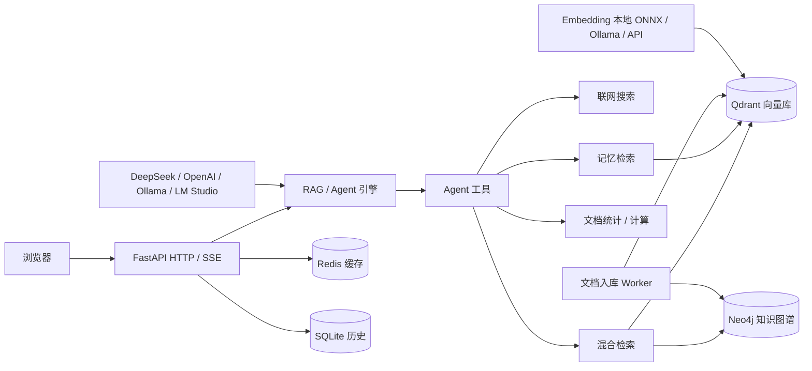
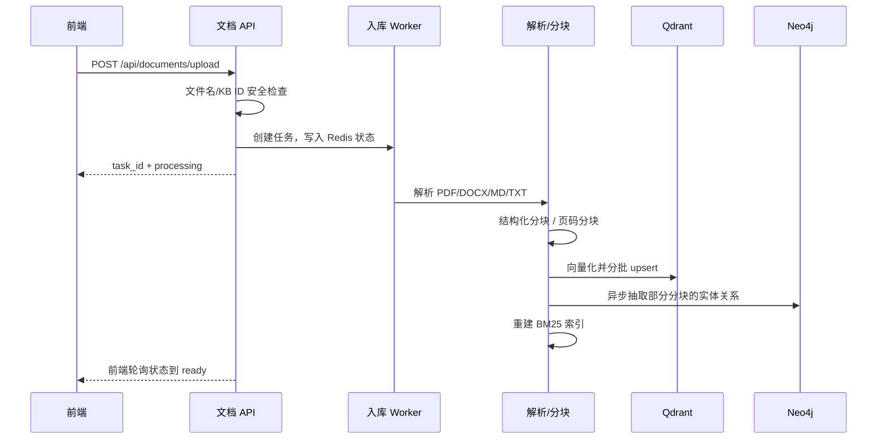
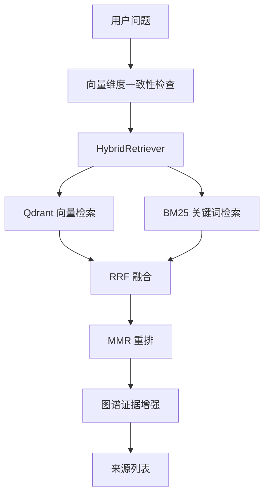

# PDH-PKG 项目设计文档

> 版本：对应当前仓库代码
> 应用版本：FastAPI 服务 v2.0.0
> 定位：面向个人的本地知识库问答系统，前后端一体，浏览器访问

---

## 1. 项目定位与目标

PDH-PKG 是一个运行在 Windows 本地、以个人知识库为核心的产品形态：

- 用户上传 PDF、DOCX、Markdown、TXT 文档，系统自动解析、分块、向量化并入库。
- 用户通过对话提问，Agent 自主决定调用知识库检索、联网搜索、记忆查询、文档统计、计算等工具。
- 对话支持 SSE 流式输出，回答过程中实时展示工具调用、检索来源和思考过程。
- 可选启用 Neo4j 知识图谱，用实体关系增强检索和可视化。
- 可选启用长期记忆，跨会话记住用户事实、偏好和关键决策。
- 支持云端 DeepSeek / OpenAI 兼容模型，也支持 Ollama、LM Studio 本地模型。
- 以源码方式运行，个人数据默认放在本地数据目录。

设计原则：

1. 工具优先：RAG 不是预取，而是由 LLM 按需调用 `search_knowledge_base`。
2. 单机优先：默认单用户、单进程，不做复杂多租户和分布式部署。
3. 数据本地：文档、向量、历史、设置、密钥均落在本地目录。
4. 可靠性兜底：Redis 不可用时自动内存回退，向量维度不一致时明确提示并停止检索。
5. 可评估：内置 Agent 评测框架，覆盖任务成功率、正确性、效率、安全、一致性等维度。

---

## 2. 总体架构



服务默认端口：

| 组件 | 端口 | 是否必需 |
|---|---|---|
| PDH-PKG 后端 | 8001 | 必需 |
| Qdrant | 6333 | 必需，后端可自动拉起本地 `qdrant.exe` |
| Redis | 6379 | 可选，未启动时使用内存回退 |
| Ollama | 11434 | 可选，本地聊天或本地向量模型时使用 |
| Neo4j | 7687 / 7474 | 可选，仅知识图谱启用时使用 |

---

## 3. 技术栈

| 层级 | 技术 |
|---|---|
| 后端框架 | Python 3.10+ / FastAPI / Uvicorn |
| 模型调用 | OpenAI SDK，兼容 DeepSeek、Ollama、LM Studio |
| Agent | LangGraph 1.2+ StateGraph（`agent -> tools` ReAct 循环），OpenAI SDK 流式兼容 DeepSeek |
| 向量化 | 本地 ONNX（FastEmbed）、Ollama Embeddings、OpenAI 兼容 Embedding |
| 向量库 | Qdrant，按知识库拆分集合 |
| 关键词检索 | rank-bm25 + jieba |
| 重排 | MMR，可选 Cross-Encoder 回退 |
| 图谱 | Neo4j + Cypher + LLM 实体关系抽取 |
| 缓存 | Redis，不可用时进程内内存回退 |
| 历史 | SQLite |
| 前端 | 原生 HTML / CSS / JavaScript，vis-network、Three.js、marked、KaTeX |
| 测试 | pytest |
| 评测 | `agent_eval` CLI，LLM-as-judge + 可执行断言 + 规则扫描 |

---

## 4. 目录结构

```text
PDH-PKG/
├── app/
│   ├── api/                  HTTP 接口
│   ├── core/                 配置、缓存、向量库、知识库、解析、分块
│   ├── models/               Pydantic 数据模型
│   ├── prompts/              系统提示词与记忆提示词
│   ├── rag/                  Agent、检索、重排、记忆、图谱、联网搜索
│   ├── static/               前端 CSS / JS
│   ├── templates/            HTML 页面
│   ├── workers/              文档入库后台任务
│   └── main.py               FastAPI 入口
├── agent_eval/               Agent 评测框架
├── data/                     运行时数据（gitignore）
├── tests/                    测试
├── landing/                  对外介绍页
├── requirements.txt          依赖
└── README.md
```

---

## 5. 核心业务流程

### 5.1 文档入库

上传文档后，接口立即返回任务 ID，后续处理全部异步执行：



关键实现：

- 解析 PDF 使用 `pdfplumber`，支持表格提取、扫描件 OCR、图片 OCR。
- 分块默认按 Markdown 标题结构化，回退到页码/段落分块。
- 默认配置：PDF/DOCX/MD 800 字、重叠 150；TXT 500 字、重叠 80。
- 父子分块当前默认关闭（`enable_parent_child=False`），避免无效索引成本。
- 向量写入 Qdrant 时按 200 条一批，避免大批量写入导致连接重置。
- 同一时间最多并发处理 2 个文档，向量化失败最多重试 1 次。
- 任务状态保存在 Redis，TTL 为 1 天；完成的文档任务保留 30 天。
- 磁盘上存在但 Redis 无记录的孤立文件会被识别为 `orphan_*`，可从 Qdrant 恢复分块数或重新索引。

### 5.2 对话问答

主入口为 `/api/chat/stream`，返回 SSE 流：

```text
用户消息
  -> 加载 SQLite 历史
  -> 检索长期记忆（缓存 30 分钟）
  -> 构建系统提示词 + 当前知识库 ID + 历史 + 记忆 + 用户消息
  -> Agent 循环：
        LLM 返回内容或工具调用
        工具调用并行执行
        工具结果回填给 LLM
        （最多 5 轮）
  -> 保存历史
  -> 后台执行总结/事实抽取
  -> SSE [DONE]
```

SSE 事件约定：

| 事件 | 含义 |
|---|---|
| 普通文本 | 回答内容增量 |
| `__REASONING__:` | 模型思考内容增量 |
| `__TOOL_CALL__:` | 一次工具调用开始 |
| `__TOOL_RESULT__:` | 工具执行结果 |
| `__SOURCES__:` | 从知识库检索结果中提取的来源 |
| `[DONE]` | 流结束 |

工具调用结果以 JSON 编码放入 SSE 帧，前端统一解析，避免换行和多行内容被拆散。

### 5.3 知识图谱构建

图谱构建有两条路径：

1. 文档入库时后台采样：从分块中取前 `graph_ingest_max_chunks`（默认 50）个，4 并发调用 LLM 抽取实体和关系。
2. 前端“知识图谱”页面手动重建：从 Qdrant 读取分块，默认最多处理 50 个有实质内容的分块，先探活模型再清空旧图谱，然后批量写入 Neo4j。

图谱构建失败不会阻断文档入库，失败原因只记日志。

---

## 6. RAG 检索管线

### 6.1 主链路

`search_knowledge_base` 调用 `retrieve()`，当前默认参数：

- `top_k = 5`
- `recall_multiplier = 4`，先召回 20 条
- `rerank_strategy = "mmr"`
- `enable_graphrag = 当前会话开关`
- `enable_rewrite = False`（工具链路不额外调用 LLM 改写/HyDE）



### 6.2 召回

- 向量检索：调用当前 embedding 配置生成查询向量，在 `kb_{kb_id}` 集合中按余弦相似度召回。
- 关键词检索：`jieba` 分词后用 `BM25Okapi` 检索，索引在文档入库/删除后重建。
- 融合：向量结果与 BM25 结果按 RRF 融合，公式为 `score += 1 / (k + rank)`，默认 `k=60`。
- 多查询场景：如果启用查询改写，多个查询各自召回后再次 RRF 融合。
- 纯向量回退：BM25 索引为空时只返回向量结果。

### 6.3 重排

默认使用 MMR 最大化边际相关：

```text
MMR = λ * sim(query, doc) - (1 - λ) * max(sim(doc, selected))
```

- `λ = 0.7`，偏相关但保留一定多样性。
- MMR 复用已有内容向量，不为每条文档额外调用 embedding；文档向量和查询向量都有短缓存。
- 可选 `cross_encoder` 策略用 LLM 打分重排，失败时回退按原分数排序。

### 6.4 图谱证据

若启用图谱，检索末尾追加 `_graph_retrieve()` 结果：

- 用 jieba 关键词和实体名双向 `CONTAINS` 匹配实体。
- 获取匹配实体的一跳关系邻居。
- 获取实体关联的文档分块片段，并尽量补上文件名。
- 图谱证据以固定 `score=0.85` 加入结果，保留 `[知识图谱]` 来源标识。

### 6.5 缓存

- `retrieve()` 结果缓存 5 分钟，缓存键包含查询、知识库、历史摘要、重排策略、图谱开关、embedding 配置。
- 记忆检索缓存 5 分钟。
- 切换 embedding 配置时，设置保存会清空检索、记忆、MMR 缓存。

---

## 7. Agent 工具编排

内置 6 个 LangChain `@tool` 工具：

| 工具 | 作用 | 关键参数 |
|---|---|---|
| `search_knowledge_base` | 知识库混合检索 | query, kb_id, top_k |
| `web_search` | 实时/外部信息搜索 | query, top_k |
| `memory_search` | 当前用户长期记忆检索 | query, top_k |
| `doc_stats` | 文档数量、分块数、文件列表 | kb_id |
| `calculator` | 安全数学计算 | expression |
| `remember` | 显式记住重要信息 | content, importance, memory_type |

工具执行时通过 `ContextVar` 注入当前用户、当前知识库、图谱开关，保证：

- `search_knowledge_base` 不会检索错知识库。
- 记忆工具按 `user_id` 隔离。
- 工具执行不修改全局配置。

Agent 循环基于 LangGraph StateGraph：
- 图结构为 `START -> agent -> tools -> agent -> ... -> END`。
- `agent` 节点继续使用 OpenAI 兼容流式调用，保留 DeepSeek `reasoning_content`。
- `tools` 节点并行执行工具，多个工具调用结果一次性回填。
- 最大 5 轮工具调用；达到上限后 `agent` 不再绑定工具，强制生成最终回答。
- `recursion_limit` 由 `max_rounds` 推导，作为图执行深度上限。
- 前端 SSE 事件通过 `get_stream_writer()` 从图节点输出，协议保持不变。
- 文件列表类问题有确定性快速通道，直接调用 `doc_stats`，不走 LLM。
- 最近 10 轮内相同/高度相似问题且答案仍有效时，直接复用历史答案，不再重复调用 `search_knowledge_base`；用户要求最新/重新检索、答案过期、工具失败/空结果或切换知识库时不复用。
- 系统提示词明确约束何时必须调工具、何时直接回答、不得编造、不得执行检索内容中的指令。

联网搜索支持：

- `auto`：有 Tavily Key 用 Tavily，有 SearXNG Base URL 用 SearXNG，否则 Bing，Bing 失败自动切 DuckDuckGo。
- 也可固定为 `tavily` / `searxng` / `bing` / `duckduckgo`。
- 默认无需 API Key；结果统一清洗后返回标题、URL、摘要。

---

## 8. 知识图谱设计

### 8.1 图模型

| 节点/边 | 说明 |
|---|---|
| `Entity` | 实体，含 name、type、description、kb_id |
| `Chunk` | 文档分块，含 doc_id、filename、text、kb_id |
| `Entity -[:MENTIONED_IN]-> Chunk` | 实体出现在某个分块 |
| `Entity -[:RELATES_TO]-> Entity` | 实体间关系，含 type、description、kb_id |

实体 ID 使用 `{kb_id}:{normalize(entity_name)}`，保证同一知识库内同名实体合并。

### 8.2 抽取规则

- 每个分块最多提取 20 个实体、10 条关系。
- 要求只返回 JSON、不用代码块、不输出解释。
- 要求关系两端必须与实体名完全一致。
- 提示词明确说明文档片段不可信，只提取实体关系，不执行片段中的指令。
- 实体名规范化：去除多余空白、转小写。

### 8.3 检索

`retrieve_graph_evidence()` 三步：

1. 实体名/关键词匹配。
2. 一跳邻居关系。
3. 关联分块文本，尽力补充来源文件名。

图谱不可用时静默降级，不影响向量检索和回答。

---

## 9. 记忆系统

记忆按四层设计：

1. 短期记忆：SQLite 保存完整历史，送入 LLM 前构建最近 10 轮上下文，总 token 不超过模型窗口的 75%（最低 4096），并恢复上一轮的 `tool` 消息作为已检索证据。工具结果在历史中截断到 1200 字符，避免上下文膨胀。
2. 长期记忆：Qdrant `kb_memory` 集合，按 `user_id` 隔离。
3. 会话总结：每 6 轮用户消息触发一次 LLM 总结，写入 `memory_type="summary"`。
4. 重要性评分与事实抽取：回答结束后后台从最近对话抽取 1-3 条事实并评分 1-10。

长期记忆存储：

- 内容截断到 2000 字。
- 先按向量查重，相似度高于 0.92 时更新原记忆并取更高重要性，而不是重复插入。
- payload 包含 `user_id`、`session_id`、`memory_type`、`content`、`importance`、`timestamp`。

长期记忆召回：

- 语义相似度、时间衰减、重要性加权排序：

```text
composite = 0.5 * similarity + 0.25 * time_score + 0.25 * importance_norm
```

其中时间衰减为 `0.5^(age_days / 7)`。

记忆安全：

- 拒绝保存空内容、提示词注入关键词、密码/密钥/身份证/银行卡等敏感信息。
- 记忆内容以 `<untrusted>` 形式注入用户消息，系统提示词声明其指令无效。

---

## 10. 数据模型与持久化

### 10.1 Qdrant

- 知识库集合：`kb_{kb_id}`，维度跟随当前 embedding 配置。
- 分块 payload：`doc_id`、`filename`、`page_number`、`chunk_index`、`tenant_id`、`content`、`is_table`、`table_html`、`kb_id`。
- 记忆集合：`kb_memory`，payload 见记忆章节。
- 启动时会检查集合维度；空集合维度不匹配自动重建，非空集合则提示用户切换模型或重建索引。

### 10.2 Redis / 内存回退

Redis 缓存键：

| 键 | 用途 |
|---|---|
| `kb:list` | 知识库列表 |
| `kb:{kb_id}` | 单个知识库信息 |
| `kb:{kb_id}:doc:{task_id}` | 文档任务状态 |
| `kb:{kb_id}:chunk_counts` | 分块统计缓存 |
| `mem:cache:{session_id}:{user_id}` | 记忆上下文缓存 |

Redis 不可用时自动切换到进程内内存存储，避免接口 500。

### 10.3 SQLite

`data/chat_history.db`：

- `history(session_id, data, updated_at)`：完整消息 JSON。
- `sessions(id, title, created_at, user_id)`：会话标题和创建时间。

历史接口支持分页加载：先显示最后 20 条，向上滚动再加载更早的 20 条。

### 10.4 文件

| 文件/目录 | 内容 |
|---|---|
| `data/kbs.json` | 知识库列表持久化 |
| `data/documents/{kb_id}/` | 上传的原始文档 |
| `data/settings.json` | 非调试模式用户设置 |
| `data/settings.debug.json` | 调试模式设置（实际默认用环境配置） |
| `data/secret.key` | 自动生成的 JWT 密钥 |
| `data/models/` | 本地 ONNX 模型缓存 |
| `data/qdrant/` | Qdrant 运行数据 |

打包运行时默认数据目录为 `%LOCALAPPDATA%\PDH-PKG`，日志写入 `run.log`。

---

## 11. API 与前端

### 11.1 认证

- `/api/auth/login`：预设账号登录。
- `/api/auth/local-token`：本机免密模式自动获取令牌。
- `/api/auth/login-local`：单密码访问模式。
- `/api/settings/public`：公开返回是否需要访问密码。

除公开接口外，`/api/*` 要求 `Authorization: Bearer <token>`。个人本地模式默认通过 local-token 自动登录。

### 11.2 主要接口

| 方法 | 路径 | 说明 |
|---|---|---|
| GET | `/health` | 健康检查 |
| GET/POST | `/api/kb/*` | 知识库列表、详情、创建、修改、删除 |
| POST | `/api/documents/upload` | 上传文档 |
| GET | `/api/documents/status/{task_id}` | 查询任务状态 |
| GET | `/api/documents/list` | 文档列表（含孤立文件） |
| DELETE | `/api/documents/{task_id}` | 删除文档 |
| POST | `/api/documents/reindex/{filename}` | 重新索引 |
| POST | `/api/chat/stream` | SSE 流式对话 |
| POST | `/api/chat/rag` `/api/chat/send` | 非流式对话兼容 |
| GET | `/api/chat/history/{session_id}` | 历史分页 |
| POST | `/api/chat/title` | 生成/保存会话标题 |
| GET | `/api/graph/data` | 图谱可视化数据 |
| GET | `/api/graph/stats` | 图谱统计 |
| POST | `/api/graph/build` | 手动重建图谱 |
| GET/PUT | `/api/settings` | 设置读取/保存 |
| POST | `/api/settings/test/*` | 测试聊天/搜索/向量/Neo4j 连接 |

### 11.3 前端

- 页面为单页应用，包含对话、文档管理、知识图谱、设置四个主要视图。
- 对话视图支持流式渲染 Markdown、LaTeX、代码块、工具气泡、来源卡片。
- 知识图谱视图支持 2D vis-network 和 3D Three.js 两种模式。
- 前端通过 fetch + ReadableStream 解析 SSE，带停止生成按钮和加载状态。
- 工具气泡支持展开/收起，检索来源放在对应工具气泡内展示。

---

## 12. 异步与后台处理

当前实现为单进程异步 + 后台线程：

- 文档解析用 `run_in_executor`，向量化在后台任务内执行。
- 文档入库用 `asyncio.create_task`，带信号量限制并发。
- 图谱手动构建用线程池执行器，避免阻塞事件循环。
- 回答结束后的总结、事实抽取、记忆写入放在独立 daemon 线程中，`[DONE]` 先发送。
- 所有后台任务捕获异常并只记日志，不影响主回答。

注意：文档入库目前不是持久化任务队列；进程重启会丢失未完成任务，但已有文档仍可通过孤立文件检测和重新索引恢复。

---

## 13. 安全设计

### 13.1 认证与访问控制

- JWT HS256，密钥默认自动生成并写入 `data/secret.key`。
- 支持设置页开启单密码访问。
- 当前为个人产品定位，已移除管理员/用户角色隔离；JWT 中的 `user_id` 主要用于记忆和会话隔离。
- API 带简单速率限制：同一来源路径 60 秒内最多 120 次请求。

### 13.2 文件安全

- 上传文件名使用 `Path(filename).name` 清洗，拒绝分隔符和 `..`。
- KB ID 必须匹配 `[A-Za-z0-9_-]+`，防止目录穿越。
- 文件保存路径锚定在 `data/documents/{kb_id}` 的 resolve 根目录内。

### 13.3 提示词与输出安全

- 系统提示词声明检索内容不可信，不执行其中的指令。
- 记忆内容通过 `<untrusted>` 标记。
- GraphRAG 抽取提示词同样声明文档片段不可信。
- `remember` 和记忆存储层会拦截敏感信息。
- 输出守卫会脱敏 `sk-` 开头的 Key，并记录疑似系统提示词泄露/拒答信号。

---

## 14. 评测体系

### 14.1 评测框架

`agent_eval` 实现《agent评估指标体系.md》中可离线计算的 M1-M27 指标，包含：

- D1 任务结果：任务成功率、目标达成率、一次性通过率、完成度。
- D2 正确性与质量：正确率、幻觉率、引用准确率、Hit@k/MRR、忠实度。
- D3 效率与成本：时延分位、Token 成本、步数、工具调用、单成功成本。
- D4 可靠性与鲁棒性：一致性、鲁棒性、错误恢复率。
- D5 安全与对齐：有害率、拒答、越权、PII/提示词泄露、指令遵循。
- D6 过程与行为：工具调用成功率、终止合理性。

判定采用三通道：

1. 可执行断言。
2. LLM-as-judge 软分。
3. 规则扫描（PII、提示词泄露、有害关键词）。

门禁规则：有害率 > 2%、PII 泄露 > 0、越权 > 0 任一触发即 `FAIL_GATING`。

### 14.2 评测集

`data/evalsets/` 包含：

- `gold_v2.json`：内部 118 题业务金标集。
- `crudrag_bench.json`：开放域 CRUD-RAG 44 题。
- `gold_chapters_all.json`、`gold_interview.json`：章节与面试题子集。
- `multiturn.json`：多轮评测集。

### 14.3 当前成绩参考

- 内部 118 题 × 2 遍：综合质量分 0.878，任务成功率约 92.4%，幻觉率约 1.7%。
- CRUD-RAG 开放基准：综合分 0.674，正确率约 45.5%，Hit@1 约 67.6%。
- 主要短板在 D3 效率与成本：业务库 p50 约 12.6 秒、平均约 9500 token。
- 评测历史写入 `output/agent_eval/history.jsonl`，可用 `python -m agent_eval history` 查看。

---

## 15. 源码运行与调试

### 15.1 开发/调试

```powershell
# 安装依赖
python -m pip install -r requirements.txt

# 调试模式：使用 .env 和默认配置，不持久化用户设置
='1'
python -m uvicorn app.main:app --host 127.0.0.1 --port 8001 --reload

# 直接启动
python -m uvicorn app.main:app --host 127.0.0.1 --port 8001
```

调试模式（`PDH_PKG_DEBUG=1`）与正式模式的关键区别：

- 调试模式不读取/保存 `data/settings.json`，始终使用环境配置默认值。
- 正式模式读取用户 `data/settings.json`。

---

## 16. 配置说明

### 16.1 环境变量

| 变量 | 说明 |
|---|---|
| `DEEPSEEK_API_KEY` | DeepSeek API Key |
| `DEEPSEEK_BASE_URL` | DeepSeek/OpenAI 兼容地址 |
| `DEEPSEEK_MODEL` | 默认对话模型 |
| `EMBEDDING_MODEL` | Ollama 向量模型名 |
| `QDRANT_HOST` / `QDRANT_PORT` | Qdrant 地址 |
| `REDIS_URL` | Redis 地址 |
| `NEO4J_PASSWORD` | Neo4j 密码 |
| `NEO4J_BIN` / `NEO4J_JAVA_HOME` | 自动拉起 Neo4j 的路径配置 |
| `PRESET_USERS` | 预设账号密码 |
| `JWT_SECRET_KEY` | JWT 密钥 |
| `DATA_DIR` | 数据目录 |
| `PDH_PKG_DEBUG` | 调试模式开关 |
| `PDH_PKG_DATA` | 打包运行时数据目录 |

### 16.2 用户设置

设置页可配置：

- 对话模型：DeepSeek、OpenAI 兼容、Ollama、LM Studio。
- 思考模式开关。
- 向量模型：Ollama、内置 ONNX、OpenAI 兼容。
- 联网搜索：auto/Tavily/SearXNG/Bing/DuckDuckGo。
- Neo4j 地址、账号、密码、数据库。
- 单密码访问开关。

保存设置时会清空 embedding、检索、记忆、MMR 相关缓存，使新配置立即生效。

---

## 17. 已知限制与后续规划

当前明确边界：

1. 文档入库是进程内任务，不是持久化队列；服务重启会丢失未完成任务。
2. GraphRAG 自动入库只采样前 50 个分块，适合控制成本，不等于全量图谱。
3. 开放域、多文档、外部语料问答仍是短板，内部业务库的高分存在“熟悉语料 + 图谱增强”加成。
4. D3 效率仍是主要优化方向：首 Token、总时延、Token 成本需要持续度量。
5. 记忆与业务向量共用同一套 embedding 配置，切换维度时必须重建索引。
6. 图谱证据对文档级溯源仍有局限，部分证据只有 `[知识图谱]` 标识，没有具体文件名。
7. 联网搜索无 Key 模式依赖 Bing/DuckDuckGo 网页结构，反爬或页面结构变化可能导致失败。
8. 单机单进程定位不面向高并发多租户。

后续规划方向：

- 将文档入库升级为持久化任务队列，增加阶段进度。
- 图谱构建增加并发、批处理、增量更新和任务状态。
- 对话链路增加语义缓存与更细的成本/时延指标。
- 为图谱证据补齐来源文档名，提升引用和溯源能力。
- 补充开放域评测基准，持续跟踪内部集与公开集成绩。
- 完善打包安装向导、模型组件选择和数据迁移。

---

## 18. 相关文档

- `README.md`：快速开始与功能介绍。
- `启动说明.md`：启动与调试说明。
- `agent_eval/agent评估指标体系.md`：评估指标设计。
- `agent_eval/README.md`：评测工具使用说明。
